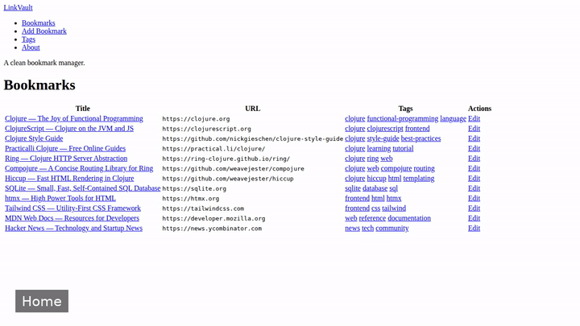
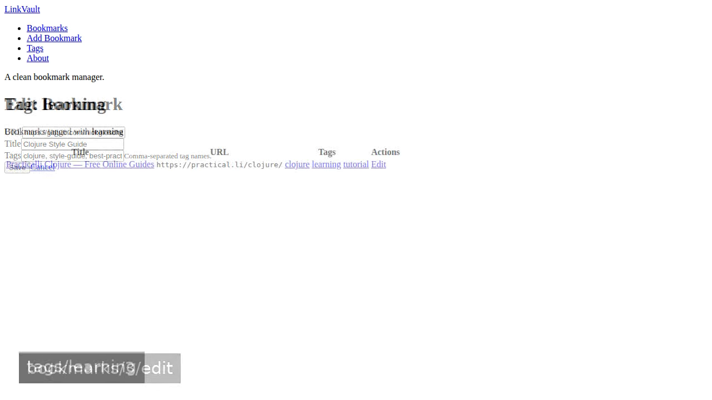
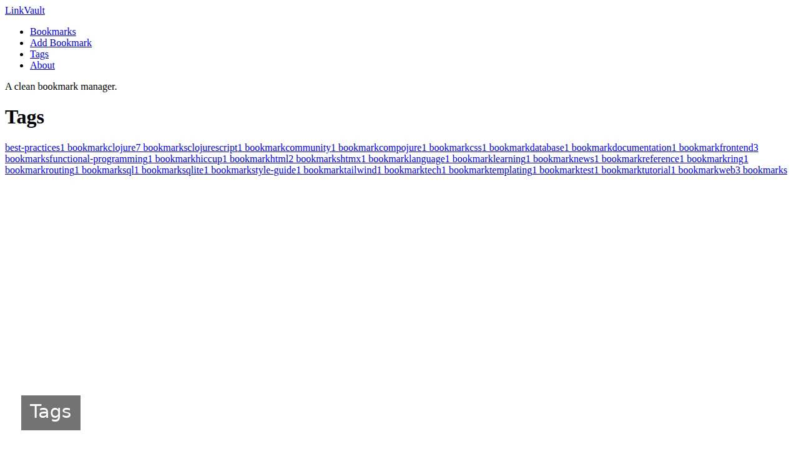

# LinkVault — open-source book knowledge base app

**LinkVault** is a free, open-source book knowledge base app built with Clojure. Build a bookmark manager web application in Clojure using Ring/Compojure for routing, Hiccup for server-rendered HTML, and SQLite for storage. Run it locally, deploy it as a self-hosted knowledge base app, or [remix it on cenius.ai](https://cenius.ai/marketplace/p/linkvault) to make it your own — the whole application (code, design, seeded demo data) ships in this repository under the MIT license.

[](LICENSE)  [](https://cenius.ai)

## Demo



▶ Full walkthrough video: [`demo.mp4`](.github/media/demo.mp4)

## Screenshots

  

## Features

- View Bookmarks List
- Add Bookmark
- Edit Bookmark
- Browse by Tag
- About Page
- Seed Sample Bookmarks

## Quick start

```bash
./install.sh   # installs dependencies + seeds demo data
```

See [`INSTALL.md`](INSTALL.md) for full setup and usage instructions.

## Usage guide

A walkthrough of every feature in LinkVault.

### Home Page

Visiting `/` redirects you to the bookmark list at `/bookmarks`.

### Bookmark List (`/bookmarks`)

The main view shows all your bookmarks in a table:

- **Title** — clickable link that opens the bookmark in a new tab
- **URL** — displayed in a monospace font
- **Tags** — clickable pills that take you to that tag's filtered view
- **Actions** — Edit button for each bookmark

The sidebar on the left provides navigation to all sections.

### Adding a Bookmark

1. Click **Add Bookmark** in the sidebar, or navigate to `/bookmarks/new`
2. Fill in the form:
   - **URL** (required) — the full web address, e.g. `https://example.com`
   - **Title** (required) — a descriptive name for the bookmark
   - **Tags** (optional) — comma-separated tag names, e.g. `clojure, tutorial, web`
3. Click **Save**

You'll be redirected back to the bookmark list where the new entry appears at the top.

### Editing a Bookmark

1. Click the **Edit** button next to any bookmark
2. Modify the URL, title, or tags as needed
3. Click **Save**

The changes are applied immediately and you return to the list.

### Browsing by Tag

#### Tag Index (`/tags`)

Shows every tag in the system as cards, each displaying the tag name and how many bookmarks use it. Click any card to filter.

#### Tag Detail (`/tags/<name>`)

Shows only bookmarks tagged with the given tag. The breadcrumb at the top confirms which tag you're viewing. Each bookmark's tag pills remain clickable, letting you pivot to other tags.

### About Page (`/about`)

_Full guide: [`USAGE.md`](USAGE.md)_

## Architecture

Clojure application, delivered as a complete, runnable project (21 files). Top-level layout: `resources/`, `src/`. `install.sh` provisions dependencies and seeds demo data, so the app boots with something to show. Setup details live in [`INSTALL.md`](INSTALL.md).

## FAQ

### How do I self-host LinkVault?

Clone this repository and run `./install.sh`, then start the app as described in [`INSTALL.md`](INSTALL.md). LinkVault is fully self-hostable — no external services are required to try it.

### Is LinkVault free for commercial use?

Yes. The code is MIT-licensed — use it, modify it, and ship it commercially. See [LICENSE](LICENSE).

### Can I rebrand or white-label LinkVault?

Yes — and the easiest way is [remixing it on cenius.ai](https://cenius.ai/marketplace/p/linkvault): modifications made on the platform come with full rebrand and relicense rights over your derivative.

### How can I customize LinkVault without editing code?

Open it on [cenius.ai](https://cenius.ai/marketplace/p/linkvault) and describe the changes you want in plain English — the platform modifies the app and gives you a new, downloadable build.

### What is LinkVault built with?

Clojure. The full source in this repository is exactly what the app runs.

## License & rebranding

Released under the [MIT License](LICENSE) (© 2026 Cenius AI) — free for personal and commercial use.

**Need a customized version?** [Remix this app on cenius.ai](https://cenius.ai/marketplace/p/linkvault) — modifications made on the platform come with **full rebrand & relicense rights** over your derivative.

## Built with cenius.ai

This entire application — code, design, seeded demo data — was generated on **[cenius.ai](https://cenius.ai)** from a plain-English description.

- 🚀 [Build your own app on cenius.ai](https://cenius.ai)
- 🎛️ [Remix LinkVault on the marketplace](https://cenius.ai/marketplace/p/linkvault) — open it in a workspace, prompt for changes, and ship your own version.

More open-source apps: [the Cenius-ai catalog](https://github.com/Cenius-ai) · [showcase index](https://github.com/Cenius-ai/showcase)
